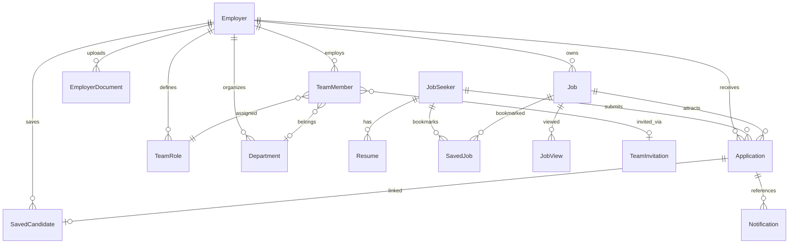

# AsliJobs — Database Architecture

**ODM:** Mongoose 8  
**Database:** MongoDB (`MONGO_URI`)  
**Source:** `backend/src/modules/**/**.model.ts`

---

## 1. Collections overview

| Model | Collection | Primary purpose |
|-------|------------|-----------------|
| Employer | `employers` | Employer accounts & company profile |
| EmployerDocument | `employer_documents` | KYC / identity uploads |
| JobSeeker | `jobseekers` | Job seeker accounts & preferences |
| Job | `jobs` | Job posts |
| JobCounter | `job_counters` | Public job ID sequencing (`AJ-YYYY-######`) |
| JobView | `job_views` | Per-visitor view ledger |
| Application | `applications` | Applications + embedded interview/offer/shortlist |
| Resume | `resumes` | Job seeker resumes |
| SavedJob | `saved_jobs` | Seeker bookmarks |
| SavedCandidate | `saved_candidates` | Employer saved/shortlist rows |
| Notification | `notifications` | Inbox + message conversation events |
| TeamMember | `teammembers` | Employer team users |
| TeamRole | `teamroles` | Roles, permissions, fieldAccess |
| TeamInvitation | `teaminvitations` | Invite tokens & email delivery |
| Department | `departments` | Org units |
| TeamActivity | `teamactivities` | Audit / activity log |

**Total models:** 16

---

## 2. Entity relationships

### Key foreign-key style fields

| Child | Fields |
|-------|--------|
| Job | `employerId`, `companyId`, `createdBy` → Employer; public `jobId` string |
| Application | `jobId` → Job, `employerId`, `jobSeekerId`, `resumeId` |
| SavedCandidate | `employerId`, `applicationId`, `jobId`, `jobSeekerId` |
| SavedJob | `jobSeekerId`, `jobId` |
| Notification | `recipientId` + `recipientType`; `referenceType`/`referenceId` (often `application`) |
| Team* | `employerId` scoped |

---

## 3. Model notes

### Application (hiring hub)

Embedded subdocuments (not separate collections):

- `interview` — date, time, mode, venue/link, interviewer, cancellation fields
- `offer` — offer/joining dates, package, notes
- `shortlist` — priority, tags, notes, nextAction, shortlistedAt/by
- `statusHistory` — timeline entries
- `resumeSnapshot` — frozen resume at apply time

Unique index: `(jobSeekerId, jobId)`.

### Job

- Public code: `jobId` (e.g. `AJ-2026-000001`)
- Statuses: active, paused, draft, closed, expired (per job constants)
- Denormalized counters: applications, shortlisted, interviews, hired, views, bookmarks, shares

### Notification / Messages

- Employer “Messages” UI groups notifications where `referenceType === "application"` by `referenceId`
- Channels object: inApp, whatsapp, email, push (flags)
- Soft dismiss: `deletedAt`; inbox retention: `expiresAt`

### Team RBAC storage

- `TeamRole.permissions` — module/action matrix (Mixed/structured)
- `TeamRole.fieldAccess` — field-level matrix
- Owner employer bypasses via runtime `isSuperAdmin` context (not a DB row)

---

## 4. Cascade job deletion impact

When a job is permanently deleted (cascade service):

| Collection | Behavior |
|------------|----------|
| `notifications` | Deleted for related application refs / publicJobId metadata |
| `saved_candidates` | Deleted for job / applications |
| `applications` | Deleted for job |
| `saved_jobs` | Deleted for job |
| `job_views` | Deleted for job |
| `jobs` | Deleted |
| `jobseekers` / `resumes` | **Never deleted** |
| Orphan heal | Applications whose `jobId` no longer exists can be purged for an employer |

---

## 5. Indexes (representative)

- Applications: employer + status/appliedAt; jobId; unique seeker+job
- Jobs: employerId + status + createdAt; text index includes jobId
- Saved candidates: unique employerId + applicationId
- Notifications: recipientType + recipientId + createdAt / read / deleted

---

## 6. What is not a collection

| Concept | Storage |
|---------|---------|
| Interview calendar events | Derived from Application.interview |
| Separate Message threads | Notifications grouped by application |
| Admin users | No admin user model mounted |
| Campaigns / subscriptions | Placeholder modules only |
