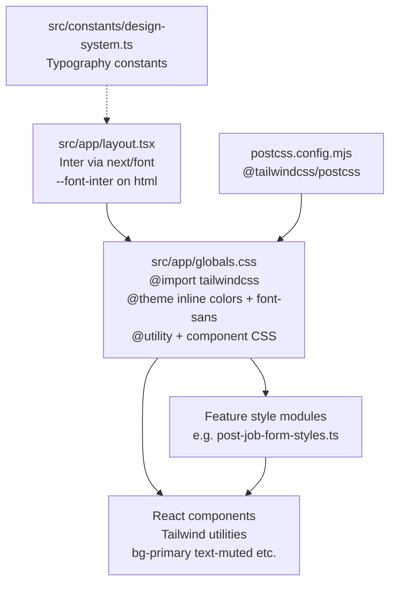

# AsliJobs Design System Documentation

**Product:** AsliJobs  
**Scope:** Frontend application (`frontend/`)  
**Audience:** Developers, UI Designers, QA, Product  
**Source of truth:** Current codebase only (no invented values)

---

## 1. Brand Identity

| Item | Value | Source |
|------|--------|--------|
| Product / brand name | AsliJobs | `src/app/layout.tsx` (`metadata.title`) |
| Site name | AsliJobs.com | `src/constants/site.ts` (`SITE_NAME`) |
| Company (legal) | Propenu Solutions Pvt Ltd. | `src/constants/site.ts` (`COMPANY_NAME`) |
| Tagline | India's Trusted WhatsApp Job Network | `src/constants/brand.ts` (`BRAND_TAGLINE`) |
| Footer description | India's trusted WhatsApp job network for blue & grey collar jobs. | `src/constants/site.ts` (`FOOTER_BRAND_DESCRIPTION`) |

### Current logos

| Asset | Path | Intrinsic size | Usage |
|-------|------|----------------|--------|
| Primary wordmark + mark (SVG) | `src/assets/AsliLogo.svg` | `213 × 70` (`viewBox="0 0 213 70"`) | Navbar, Footer, Employer/Job Seeker sidebars |
| Logo mark (PNG) | `src/assets/logos/Frame 130.png` | Rendered at `40 × 40` in sidebars | Collapsed sidebar mark; Post Job overlays / WhatsApp preview avatar |
| White logo (PNG) | `src/assets/employer-register/logo-white.png` | Image props `240 × 90` | Employer / Job Seeker register branding panel |
| Inline SVG wordmark component | `src/assets/logos/logos.tsx` (`Logos`) | `156 × 52` | Present; **not imported** by any `src` consumer in scan |
| Alternate SVG asset | `src/assets/logos/Frame 149.svg` | Present on disk | **Not referenced** by TSX imports |
| Unused PNG | `src/assets/post-job-whatsapp-logo.png` | Present on disk | **Not referenced** by TSX imports |
| App icon | `src/app/icon.png` | Next.js App Router favicon convention | Favicon (`layout.tsx` does not set explicit `metadata.icons`) |
| Apple touch icon | `src/app/apple-icon.png` | Next.js apple-icon convention | iOS home screen |

Partner / carousel logos live under `src/assets/branding/` (e.g. Amazon, Flipkart, Tata, Zomato) and are wired via `src/constants/employers.ts` / `popular-jobs.ts` into `EmployerCarousel.tsx` (`fill`, `sizes="112px"`, container `h-12 sm:h-14`).

### Logo brand colors (from SVG fills)

Observed in `AsliLogo.svg` and `logos.tsx`:

| Color | Hex | Role in logo |
|-------|-----|----------------|
| Teal | `#00BAA5` / `#00baa5` | Primary logo mark + wordmark |
| Accent yellow | `#FFD54F` | Logo accent corner |

### Logo usage guidelines (as implemented)

- Navbar: `AsliLogo.svg` at `width={213}` `height={70}`; display heights `h-[32px]` / `mobile:h-[30px]` / `sm:h-[34px]` / `lg:h-[52px]` (`Navbar.tsx`). Decorative: `alt=""`, `aria-hidden`.
- Footer brand: same SVG; display heights `h-12 w-auto sm:h-[52px] lg:h-[60px]` (`FooterBrand.tsx`).
- Sidebars: expanded wordmark `h-9 w-auto`; collapsed mark `Frame 130.png` at `40×40` with `size-9 object-contain` (`EmployerSidebar.tsx`, `JobSeekerSidebar.tsx`).
- Auth / register panel: white PNG `240×90`, CSS width `clamp(9.5rem, 38cqi, 12.5rem)`; desktop optical `margin-left` compensates PNG transparent padding (~27/217) (`EmployerRegisterPanel.tsx`, `.employer-register-logo`).
- Post Job: mark also used in submitting overlay (`72×72`) and WhatsApp preview avatar (`size-8`, rounded).
- Accessible home links use `aria-label="AsliJobs home"`.

### Brand icon

- App favicon / brand icon: `src/app/icon.png`
- Compact logo mark used in product chrome: `src/assets/logos/Frame 130.png`

---

## 2. Typography

### Font family

| Property | Value | Source |
|----------|--------|--------|
| Approved family | **Inter** (only approved product font) | `src/constants/design-system.ts`, `.cursor/rules/design-system.mdc` |
| Import method | `next/font/google` → `Inter` | `src/app/layout.tsx` |
| CSS variable | `--font-inter` | `layout.tsx` (`variable: "--font-inter"`) |
| Tailwind / body mapping | `--font-sans: var(--font-inter), ui-sans-serif, system-ui, sans-serif` | `src/app/globals.css` `@theme` |
| Body application | `font-family: var(--font-sans)` on `body`; `font-sans` on `<body>` | `globals.css`, `layout.tsx` |
| Subsets | `latin` | `layout.tsx`, `design-system.ts` |
| Display | `swap` | `layout.tsx`, `design-system.ts` |

### Font weights

Loaded and declared: **100, 200, 300, 400, 500, 600, 700, 800, 900**  
(`layout.tsx` + `DESIGN_SYSTEM_FONT_WEIGHTS`).

Commonly observed utility weights in UI: `font-medium` (500), `font-semibold` (600), `font-bold` (700).

### Font sizes (observed patterns — not a single type-scale file)

There is **no centralized type-scale token file**. Sizes come from Tailwind utilities and CSS.

| Pattern | Examples | Sources |
|---------|----------|---------|
| Body / UI text | `text-sm` (0.875rem), often with `font-medium` / `font-semibold` | Forms, tables, buttons |
| Card / section titles | `text-lg`, `text-xl`, `font-bold` | e.g. `postJobCardHeadingClassName` |
| Form headings (register) | `clamp(1.375rem, 2.4vw, 1.75rem)`, `font-weight: 700`, `letter-spacing: -0.025em` | `.employer-register-form-heading` |
| Caption / meta | `text-[10px]`, `text-[7px]`–`text-[9px]` (navbar tagline) | Navbar, status pills |
| Toast message | `font-size: 0.875rem`, `font-weight: 500`, `line-height: 1.45`, `letter-spacing: -0.011em` | `.asli-toast__message` |

### Line heights & letter spacing (documented where explicit)

| Context | Line height | Letter spacing | Source |
|---------|-------------|----------------|--------|
| Register form heading | `1.25` | `-0.025em` | `.employer-register-form-heading` |
| Toast message | `1.45` | `-0.011em` | `.asli-toast__message` |
| Register document subtitle | `1.45` | — | `.employer-register-document-subtitle` |
| Navbar tagline | `leading-tight` | — | `Navbar.tsx` |

---

## 3. Color Palette

### Theme tokens (`@theme inline` in `globals.css`)

These are the **canonical semantic color tokens** (72 colors).

#### Primary colors

| Token | Hex |
|-------|-----|
| `primary` | `#0e8585` |
| `primary-hover` | `#0b6f6f` |
| `primary-soft` | `#00baa5` |
| `primary-soft-hover` | `#00a896` |
| `primary-light` | `#e8f5f5` |
| `hyderabad` | `#0e8585` |
| `hyderabad-dark` | `#0b6f6f` |

#### Accent / brand

| Token | Hex |
|-------|-----|
| `brand-accent` | `#ffd54f` |

#### WhatsApp

| Token | Hex |
|-------|-----|
| `whatsapp` | `#25d366` |
| `whatsapp-hover` | `#20ba5a` |
| `whatsapp-dark` | `#128c7e` |
| `whatsapp-darker` | `#0d6f63` |
| `whatsapp-cta` | `#d8f0de` |
| `whatsapp-cta-mid` | `#dcf2e3` |
| `whatsapp-icon-surface` | `#ffffff` |

#### Employer CTA / blue accent

| Token | Hex |
|-------|-----|
| `employer-cta` | `#dce8fc` |
| `employer-cta-mid` | `#d8e5fb` |
| `employer-cta-end` | `#e2ebfb` |
| `employer-button` | `#2563eb` |
| `employer-button-hover` | `#1d4ed8` |
| `employer-icon` | `#2563eb` |
| `employer-icon-surface` | `#ffffff` |
| `employer-welcome-surface` | `#fdfdfd` |
| `employer-register-panel` | `#014a42` |
| `employer-register-card` | `#026a5f` |

#### Background / surface

| Token | Hex | Role |
|-------|-----|------|
| `hero-bg` | `#f4f7f8` | App / page background (common) |
| `hero-glow` | `#dce8ea` | Hero glow |
| `surface` | `#ffffff` | Cards / panels / white surfaces |
| `workflow-neutral-surface` | `#f7f9fb` | Neutral workflow surface |
| `workflow-mint-surface` | `#f3faf5` | Mint surface |
| `workflow-mint-alt-surface` | `#f4faf5` | Mint alt |
| Root body | `bg-white` | `layout.tsx` body class |

#### Text / muted / nav

| Token | Hex |
|-------|-----|
| `foreground` | `#1a2b3c` |
| `muted` | `#5a6570` |
| `nav` | `#2d2d2d` |

Placeholder text commonly uses Tailwind `placeholder:text-muted` (same as muted).

#### Borders

| Token | Hex |
|-------|-----|
| `border` | `#e5e7eb` |
| `border-subtle` | `#eef1f3` |

#### Status / danger (tokenized)

| Token | Hex | Notes |
|-------|-----|--------|
| `pin-state` | `#e53935` | Used as danger / destructive accent in UI |

There are **no** dedicated `@theme` tokens named `success`, `warning`, `error`, or `info`. Status styling also uses Tailwind palette utilities (e.g. `amber-*`, `red-*`, `slate-*`) and toast hardcodes (below).

#### Resource / benefit / category surfaces (marketing)

| Token | Hex |
|-------|-----|
| `resource-guide-surface` | `#f2fbf4` |
| `resource-guide-icon-surface` | `#dff0e3` |
| `resource-guide-icon` | `#55b95a` |
| `resource-resume-surface` | `#f5f2fd` |
| `resource-resume-icon-surface` | `#e4dff9` |
| `resource-resume-icon` | `#7257d9` |
| `resource-interview-surface` | `#fdf8f3` |
| `resource-interview-icon-surface` | `#f2e6d8` |
| `resource-interview-icon` | `#ef8b3a` |
| `resource-salary-surface` | `#f3f9fd` |
| `resource-salary-icon-surface` | `#ddeef8` |
| `resource-salary-icon` | `#4f7ff3` |
| `resource-career-surface` | `#f6f5fd` |
| `resource-career-icon-surface` | `#e5e4f8` |
| `resource-career-icon` | `#b3790e` |
| `location-chennai-icon-surface` | `#fce0ac` |
| `benefit-whatsapp-icon` | `#55b95a` |
| `benefit-whatsapp-surface` | `#eaf7eb` |
| `benefit-languages-icon` | `#7257d9` |
| `benefit-languages-surface` | `#efedfc` |
| `benefit-voice-icon` | `#ef8b3a` |
| `benefit-voice-surface` | `#faf0e6` |
| `benefit-verified-icon` | `#4f7ff3` |
| `benefit-verified-surface` | `#eaf1fd` |
| `benefit-ai-matching-icon` | `#e45b8b` |
| `benefit-ai-matching-surface` | `#f9eaef` |
| `benefit-free-icon` | `#e8ae26` |
| `benefit-free-surface` | `#fcf5e3` |
| `post-job-step-surface-start` | `#a2eddc` |
| `post-job-step-surface-end` | `#ffffff` |
| `workflow-connector` | `#aec5c5` |
| `category-construction-surface` | `#faf0e3` |

#### Social

| Token | Hex |
|-------|-----|
| `social-facebook` | `#1877f2` |
| `social-linkedin` | `#0a66c2` |
| `social-youtube` | `#ff0000` |

### Hardcoded colors outside `@theme` (selected)

| Hex / value | Context | Source |
|-------------|---------|--------|
| `#f58529`, `#dd2a7b`, `#8134af`, `#515bd4` | Instagram gradient utility | `.bg-social-instagram` |
| `#5acdb3`, `#eefffb` | Register document dropzone | `.employer-register-document-dropzone*` |
| `#e11d48` | Toast error icon | `.asli-toast--error` |
| `#d97706` | Toast warning icon | `.asli-toast--warning` |
| `#ffffff`, `#e5e7eb` | Salary range slider track/thumb | `.job-search-salary-range*` |
| Tailwind `red-600` / `red-700`, `amber-50` / `amber-700`, `slate-*` | Status pills / danger buttons | e.g. `employer-jobs.ts`, team management |

### Badge / status pill colors (constants)

From `EMPLOYER_JOB_STATUS_PILL_CLASS` (`src/constants/employer-jobs.ts`):

| Status | Classes |
|--------|---------|
| active | `bg-primary-light text-primary-soft` |
| paused | `bg-amber-50 text-amber-700` |
| draft | `bg-slate-100 text-slate-600` |
| closed | `bg-red-50 text-red-600` |
| expired | `bg-slate-50 text-slate-400` |

Additional pill maps exist in `src/constants/employer-team-management.ts` (`MEMBER_STATUS_PILL_CLASS`, `ACCESS_LEVEL_PILL_CLASS`, `ROLE_STATUS_PILL_CLASS`).

### Hover / disabled (observed)

| Pattern | Implementation |
|---------|----------------|
| Primary soft hover | `hover:bg-primary-soft-hover` / token `#00a896` |
| Primary hover | `hover:bg-primary/5`, `primary-hover` token |
| Card hover | `hover:shadow-md` on many cards |
| Disabled controls | `disabled:opacity-60`, `disabled:opacity-50`, `disabled:opacity-40`, `disabled:cursor-not-allowed`; register submit `:disabled { opacity: 0.45 }` |

---

## 4. Design Tokens

### Semantic color tokens (Tailwind utility names)

Consumed as `bg-*`, `text-*`, `border-*`, `ring-*` utilities generated from `@theme` `--color-*` variables.

| Semantic name | CSS variable | Typical utilities |
|---------------|--------------|-------------------|
| Primary | `--color-primary` | `bg-primary`, `text-primary`, `border-primary`, `ring-primary` |
| Primary hover | `--color-primary-hover` | `hover:bg-primary-hover` (and CSS) |
| Primary soft | `--color-primary-soft` | `bg-primary-soft`, `text-primary-soft` |
| Primary soft hover | `--color-primary-soft-hover` | `hover:bg-primary-soft-hover` |
| Primary light | `--color-primary-light` | `bg-primary-light` |
| Brand accent | `--color-brand-accent` | `bg-brand-accent`, etc. |
| Foreground | `--color-foreground` | `text-foreground` |
| Muted | `--color-muted` | `text-muted`, `placeholder:text-muted` |
| Surface | `--color-surface` | `bg-surface` |
| Hero background | `--color-hero-bg` | `bg-hero-bg` |
| Border | `--color-border` | `border-border` |
| Border subtle | `--color-border-subtle` | `border-border-subtle` |
| Pin / danger | `--color-pin-state` | `bg-pin-state`, `text-pin-state` |
| WhatsApp family | `--color-whatsapp*` | CTA / brand WhatsApp UI |
| Employer CTA family | `--color-employer-*` | Employer marketing CTAs |
| Nav | `--color-nav` | Nav text contexts |

### Font tokens

| Token | Value |
|-------|--------|
| `--font-inter` | Set by `next/font` on `<html>` |
| `--font-sans` | `var(--font-inter), ui-sans-serif, system-ui, sans-serif` |

### Typography constants (TypeScript)

| Constant | Value |
|----------|--------|
| `DESIGN_SYSTEM_FONT_FAMILY` | `"Inter"` |
| `DESIGN_SYSTEM_FONT_CSS_VARIABLE` | `"--font-inter"` |
| `DESIGN_SYSTEM_FONT_WEIGHTS` | `[100…900]` |
| `DESIGN_SYSTEM_TYPOGRAPHY` | Aggregates family, variable, weights, subsets, display |

**Note:** There are no TypeScript color token exports. Colors live only in CSS `@theme`.

### Gradient / surface utilities (CSS `@utility`)

Defined in `globals.css` (non-exhaustive): `bg-whatsapp-cta-surface`, `bg-employer-cta-surface`, `bg-legal-hero-surface`, `bg-job-card-selected-surface`, `bg-post-job-step-active-surface`, `text-whatsapp-blend`, `bg-social-instagram`, `scrollbar-hidden`, `scrollbar-thin`.

---

## 5. Border Radius

No single radius token file. Observed values:

| Surface | Values | Sources |
|---------|--------|---------|
| Cards | `rounded-xl`, `rounded-2xl` common | Post Job cards `rounded-2xl`; dashboard/settings/job cards `rounded-xl` |
| Buttons | `rounded-md`, `rounded-lg`, `rounded-xl` | Navbar / Post Job `rounded-md`; modals `rounded-lg`; some team actions `rounded-xl` |
| Inputs | `rounded-md` (0.375rem) | `postJobInputClassName`; `.employer-register-form-input` |
| Checkboxes | `0.3rem` | `.job-search-filter-checkbox` |
| Radios / pills | `rounded-full` / `9999px` | Status pills, radio, avatars |
| Modals / dialogs | `rounded-t-2xl` mobile → `sm:rounded-2xl` | Bulk delete, profile dialog |
| Mobile sheets | `rounded-t-[24px]` or `rounded-t-2xl` | Job search filters; employer filter drawers |
| Toasts | `20px` | `.asli-toast` |
| Focus rings | `rounded-sm` on logo links | Navbar / footer |

**Frequency snapshot (matches in `src/`):** `rounded-lg` (~508), `rounded-xl` (~349), `rounded-full` (~215), `rounded-md` (~95), `rounded-2xl` (~46).

---

## 6. Shadows

### Tailwind utilities (observed)

| Utility | Approx. usage count | Typical use |
|---------|---------------------|-------------|
| `shadow-sm` | ~117 | Cards at rest |
| `shadow-md` | ~16 | Card hover |
| `shadow-lg` | ~23 | Dialogs / drawers |
| `shadow-xl` | ~6 | Modals (e.g. bulk delete) |

### Custom box-shadows (CSS / arbitrary)

| Name / context | Value | Source |
|----------------|--------|--------|
| Navbar | `shadow-[0_1px_3px_rgba(15,23,42,0.08)]` | `Navbar.tsx` |
| Mobile filter sheet | `shadow-[0_-12px_40px_rgba(15,23,42,0.18)]` | `JobSearchMobileFilters.tsx` |
| Toast | `0 18px 40px rgba(26, 43, 60, 0.1), 0 6px 16px rgba(26, 43, 60, 0.06), … inset highlights` | `.asli-toast` |
| Register searchable select panel | `0 10px 30px color-mix(in srgb, var(--color-foreground) 12%, transparent)` | `.employer-register-searchable-select-panel` |
| Salary thumb | `0 2px 6px rgba(15, 23, 42, 0.14), …` | `.job-search-salary-range__input` |
| Focus rings | `0 0 0 2px` / `3px` with `color-mix` on primary | Form focus styles |

---

## 7. Spacing

### Page / container

| Pattern | Value | Source |
|---------|--------|--------|
| Site container max width | `max-w-7xl` | `Container.tsx`, job search, applied/saved jobs |
| Site container padding | `px-4 sm:px-6 lg:px-8 xl:px-10` | `Container.tsx` |
| Employer dashboard page | `px-4 py-5 sm:px-6 sm:py-6 lg:px-8` | `EmployerDashboardHome.tsx` |
| Employer dense workspace shell | `max-w-[1600px]` + `px-3 py-5 sm:px-5 lg:px-6` | Candidates, saved candidates, messages, interviews, settings, profile |
| Post Job content shell | `px-4 py-4 sm:px-6 sm:py-5 lg:px-8 lg:py-6` | `postJobContentShellClassName` |
| Post Job content max width | `max-w-[1200px]` | `post-job-form-styles.ts` / `PostJobHeader.tsx` |
| Job details layout | `max-w-[1440px]` + `px-4 … xl:px-10` | `JobDetailsPageLayout.tsx` |
| Job seeker / resume | `max-w-7xl` / `max-w-6xl` + `px-4 sm:px-6 lg:px-8` | Applied jobs, resume, profile dashboard |
| Narrower content shells | `max-w-5xl`, `max-w-3xl` | Success / detail / empty / notifications states |

### Card / grid gaps

| Pattern | Value | Source |
|---------|--------|--------|
| Post Job card padding | `p-4 sm:p-5 lg:p-6` | `postJobCardClassName` |
| Dashboard stat card | `p-3.5 sm:p-4` | `DashboardStatCards.tsx` |
| Post Job form grid gap | `gap-4 sm:gap-5 lg:gap-6` | `postJobFormGridGapClassName` |
| Dashboard sections | `gap-4` | Employer dashboard home |

---

## 8. Icons

| Item | Detail | Source |
|------|--------|--------|
| Primary icon library | **Lucide React** (`lucide-react` ^1.23.0) | `package.json`; ~167 files import it |
| Secondary icon library | **Bootstrap Icons** (`bootstrap-icons` ^1.13.1) | `package.json`; CSS import in `globals.css` |
| Other icon packs | None in dependencies (`react-icons` / Heroicons / FA not present) | `package.json` |
| Bootstrap usage | Classes `bi bi-*` (e.g. `bi-whatsapp`, `bi-check2-all`, bottom nav fill icons) | `HeroIcons.tsx`, `HeroPhoneMessageBubble.tsx`, `floating-bottom-nav.ts`, `FloatingBottomNav.tsx` |

### Observed Lucide `size-*` frequencies (matches in `src/`)

| Class | Approx. match count |
|-------|---------------------|
| `size-4` | 263 |
| `size-3` | 208 |
| `size-3.5` | 161 |
| `size-5` | 79 |
| `size-8` | 70 |
| `size-6` | 23 |
| `size-7` | 22 |

Paired `w-4 h-4` / `w-5 h-5` / `w-6 h-6` icon sizing: **not used** in `src` (prefer `size-*`).

### Observed explicit `strokeWidth` frequencies (Lucide JSX)

| Value | Approx. count | Example contexts |
|-------|---------------|------------------|
| `2` | 131 | Sidebars, category icons, most UI |
| `2.25` | 20 | Tables / filters |
| `2.5` | 17 | Chips, apply buttons |
| `1.75` | 17 | Job details, denser chrome |
| `1.7` | 1 | `FloatingBottomNav.tsx` |
| `2.75` | 2 | Selected category icons |

Many Lucide usages omit `strokeWidth` (library default). There is **no** global stroke-width constant.

---

## 9. Buttons

**No shared `Button` component** exists under `src/components/ui` (or equivalent). Buttons are Tailwind `className` strings / `<Link>` / `<button>` patterns.

### Primary (soft teal fill)

- Classes: `bg-primary-soft text-white hover:bg-primary-soft-hover rounded-md` (+ height/padding/focus ring)
- Examples: Navbar “Job Seeker”; `postJobContinueButtonClassName`

### Secondary / outline

- Classes: `border border-primary` or `border-primary-soft`, `bg-transparent` / `bg-surface`, text in primary family, `hover:bg-primary/5` or `hover:bg-primary-light`
- Examples: Navbar “Employers”; `postJobBackButtonClassName`

### Neutral outline

- Classes: `border border-border-subtle … hover:bg-primary-light/30`
- Example: modal Cancel in `EmployerJobsBulkDeleteModal.tsx`

### Ghost-like (icon / text actions)

- No named “ghost” variant; near-equivalent: transparent bg + `hover:bg-primary-light` (e.g. candidate list action buttons)

### Danger

- Token-based: `bg-pin-state text-surface` (`EmployerJobsBulkDeleteModal.tsx`)
- Tailwind red: `bg-red-600 hover:bg-red-700` (team management)

### Disabled

- `disabled:opacity-40|50|60`, `disabled:cursor-not-allowed`; register submit CSS `opacity: 0.45`

### Focus

- Common: `focus-visible:outline-none focus-visible:ring-2 focus-visible:ring-primary/30` or `/40`

---

## 10. Inputs

### Text input (Post Job shared)

`postJobInputClassName`:

- Height `h-12`, `rounded-md`, `border-border`, `bg-surface`, `text-sm`, `placeholder:text-muted`
- Focus: `focus:border-primary focus:ring-2 focus:ring-primary/20`

### Textarea (Post Job)

`postJobTextareaClassName`: same border/focus language; `min-h-[5.5rem]` / `sm:min-h-[6.5rem]`

### Employer register / login inputs

CSS class `employer-register-form-input`:

- Height `3rem` (`3.25rem` ≥1024px), radius `0.375rem`, padding-inline `0.875rem`
- Focus: thicker border + `box-shadow` using primary mix

Also: `.employer-register-form-textarea`, searchable select, place autocomplete control.

### Checkbox / radio (job search filters)

- `.job-search-filter-checkbox` — square `1.05rem`, radius `0.3rem`, checked fill `primary-soft`
- `.job-search-filter-radio` — circle `9999px`, checked radial `primary-soft`

### Search

- Embedded in searchable select panel and various toolbar search fields using the same border/surface/muted placeholder patterns (feature-specific components).

### Dropdown / select

- Custom searchable select CSS under `.employer-register-searchable-select*`
- Feature selects (e.g. saved jobs sort) use Lucide + local classes

---

## 11. Cards

### Shared Post Job card

```
flex flex-col rounded-2xl border border-border-subtle bg-surface p-4 shadow-sm sm:p-5 lg:p-6
```

(`postJobCardClassName`)

### Other common card patterns

| Component | Radius | Border | Shadow | Padding |
|-----------|--------|--------|--------|---------|
| `SettingCard` | `rounded-xl` | `border-border-subtle` | `shadow-sm` → `hover:shadow-md` | `p-3.5` |
| `DashboardStatCards` | `rounded-xl` | `border-border-subtle` | `shadow-sm` → `hover:shadow-md` | `p-3.5 sm:p-4` |
| `JobCard` (home) | `rounded-xl` | `border-border-subtle` | `shadow-sm` → `hover:shadow-md` | `p-4` |
| `HeroCtaCard` | `rounded-2xl` | `border-border-subtle` | — | `p-4 sm:p-5` |

Selected job cards may use utility `bg-job-card-selected-surface` (gradient from primary-soft + brand-accent mixes).

---

## 12. Components

Important reusable / layout modules (paths relative to `frontend/src/`):

| Area | Components / paths |
|------|---------------------|
| Public navbar | `components/layout/Navbar.tsx`, `NavbarLanguageButton.tsx` |
| Container | `components/layout/Container.tsx` |
| Footer | `components/layout/footer/Footer.tsx`, `FooterBrand.tsx`, `FooterLinkColumn.tsx`, `FooterSocialLinks.tsx`, `FooterWhatsAppPanel.tsx`, `footer-social-icons.tsx` |
| Floating nav | `components/layout/FloatingBottomNav.tsx`, `constants/floating-bottom-nav.ts` |
| Employer shell | `components/employer-dashboard/EmployerDashboardLayout.tsx`, `EmployerNavbar.tsx`, `EmployerSidebar.tsx`, `EmployerSidebarItem.tsx`, `EmployerSearchBar.tsx`, `EmployerProfileMenu.tsx` |
| Job Seeker shell | `components/job-seeker-dashboard/JobSeekerSidebar.tsx`, `JobSeekerSidebarItem.tsx`, `JobSeekerTopBar.tsx` |
| Feature sidebars | Job search filters, applied/saved jobs, job seeker profile, legal, team members |
| Cards | Post Job styles; `SettingCard`; dashboard stat cards; home `JobCard`; hero CTA cards |
| Tables | e.g. `EmployerJobsTable`, `SavedCandidatesTable`, `DepartmentsTable`, `InterviewsTable` |
| Modals / dialogs | `EmployerJobsBulkDeleteModal`, `EmployerProfileDialog`, `EmployerJobPreviewModal`, interview/schedule modals |
| Drawers / sheets | Job search mobile filters; employer candidates / saved / interviews mobile filter sheets |
| Pagination | `components/shared/ListPagination.tsx`, `EmployerJobsPagination`, `JobSearchPagination`, `DepartmentsPagination` |
| Badges / pills | Status pill class maps in `constants/employer-jobs.ts`, `constants/employer-team-management.ts` |
| Alerts / toasts | `.asli-toast*` CSS + `utils/share-job.ts` (`showAppToast`) |
| Notifications | `components/notifications/NotificationBell.tsx`, notifications page content |
| Forms | Post Job form modules; employer/job-seeker register & login forms |
| RBAC UI | `components/rbac/Can.tsx` |

---

## 13. Responsive Breakpoints

### Tailwind defaults (used throughout)

AsliJobs uses Tailwind v4 default breakpoint names in class prefixes (`sm:`, `md:`, `lg:`, `xl:`, etc.). Common usage observed: `sm`, `md`, `lg`, `xl`.

### Custom variants (`globals.css`)

| Variant | Media query |
|---------|-------------|
| `mobile` | `(width < 768px)` |
| `lg-short` | `(min-width: 1024px) and (max-height: 820px)` |
| `lg-compact` | `(min-width: 1024px) and (max-height: 760px)` |
| `lg-tight` | `(min-width: 1024px) and (max-height: 720px)` |

### Practical layout breakpoints observed in CSS

| Context | Breakpoint |
|---------|------------|
| Employer register stacked vs split | `< 1024px` vs `≥ 1024px` |
| Job search “mobile” custom variant | `< 768px` |
| Many form grids | `640px` (`sm`) two-column |

---

## 14. Theme Architecture



### How it is organized

1. **Font:** Root layout loads Inter and exposes `--font-inter`. `@theme` maps `--font-sans` to that variable. Body uses `font-sans`.
2. **Colors:** Declared once in `globals.css` `@theme inline` as `--color-*`. Tailwind v4 generates utilities (`bg-primary`, `text-muted`, …).
3. **Typography policy:** Documented in `design-system.ts` + Cursor rule `.cursor/rules/design-system.mdc` (Inter-only).
4. **Component styling:** Mostly utility classes in TSX; some shared string exports (Post Job); large auth/register and filter control styles live in `globals.css` `@layer components` / unlayered page CSS.
5. **No `tailwind.config.ts`:** Configuration is CSS-first (Tailwind v4).

### Files that contain design tokens

| File | Contains |
|------|----------|
| `src/app/globals.css` | All color tokens, font-sans mapping, utilities, component CSS |
| `src/constants/design-system.ts` | Typography constants only |
| `src/app/layout.tsx` | Font loading + CSS variable attachment |
| Feature constants (e.g. `employer-jobs.ts`) | Status pill **class maps** (not hex tokens) |

### How components consume tokens

- Prefer semantic utilities: `bg-surface`, `text-foreground`, `border-border-subtle`, `bg-primary-soft`, …
- CSS classes reference `var(--color-*)` directly in `globals.css`
- Some features still use Tailwind palette colors (`red-600`, `amber-50`) or raw hex for one-off graphics

---

## Appendix

### 1. Files inspected

- `src/app/globals.css`
- `src/app/layout.tsx`
- `src/app/icon.png`
- `src/app/apple-icon.png`
- `src/constants/design-system.ts`
- `src/constants/brand.ts`
- `src/constants/site.ts`
- `src/constants/employer-jobs.ts`
- `src/constants/employer-team-management.ts`
- `src/constants/floating-bottom-nav.ts`
- `frontend/.cursor/rules/design-system.mdc`
- `frontend/package.json`
- `frontend/postcss.config.mjs`
- `src/assets/AsliLogo.svg`
- `src/assets/logos/logos.tsx`
- `src/assets/logos/Frame 130.png`
- `src/assets/logos/Frame 149.svg`
- `src/assets/employer-register/logo-white.png`
- `src/components/layout/Navbar.tsx`
- `src/components/layout/Container.tsx`
- `src/components/layout/footer/*`
- `src/components/employer-dashboard/EmployerSidebar.tsx`
- `src/components/job-seeker-dashboard/JobSeekerSidebar.tsx`
- `src/components/employer-register/EmployerRegisterPanel.tsx`
- `src/components/post-job/post-job-form-styles.ts`
- `src/components/employer-jobs/EmployerJobsBulkDeleteModal.tsx`
- `src/components/employer-profile/EmployerProfileDialog.tsx`
- `src/components/job-search/JobSearchMobileFilters.tsx`
- `src/components/shared/ListPagination.tsx`
- Representative card/button/icon consumer components across home, employer, and job-seeker surfaces

### 2. Logo file paths (SVG / PNG)

| Path |
|------|
| `frontend/src/assets/AsliLogo.svg` |
| `frontend/src/assets/logos/logos.tsx` (inline SVG component) |
| `frontend/src/assets/logos/Frame 130.png` |
| `frontend/src/assets/logos/Frame 149.svg` |
| `frontend/src/assets/employer-register/logo-white.png` |
| `frontend/src/app/icon.png` |
| `frontend/src/app/apple-icon.png` |

### 3. Font files used

- **No local font files** in the repo.
- Font is loaded at runtime via **`next/font/google` → Inter** in `src/app/layout.tsx`.

### 4. Theme files

- `frontend/src/app/globals.css` (primary theme registry)
- `frontend/postcss.config.mjs` (Tailwind PostCSS plugin)

### 5. Design system files

- `frontend/src/constants/design-system.ts`
- `frontend/.cursor/rules/design-system.mdc`

### 6. Tailwind configuration location

- **No `tailwind.config.ts` / `tailwind.config.js`.**
- Tailwind v4 is configured through:
  - `frontend/postcss.config.mjs` (`@tailwindcss/postcss`)
  - `frontend/src/app/globals.css` (`@import "tailwindcss"` + `@theme inline`)

### 7. Validation statement

All information in this document was extracted from the **current AsliJobs frontend codebase** as of documentation generation. Values that are not present as shared tokens or explicit constants are labeled as **observed patterns**. No colors, fonts, radii, or spacing values were invented, and this document does not recommend design changes.
